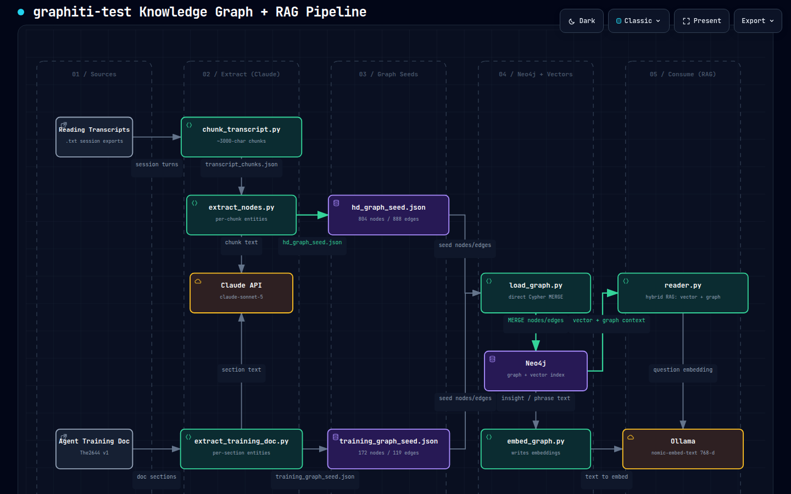

# graphiti-test

An experiment for building a Human Design knowledge graph (in [Neo4j](https://neo4j.com/)) from reading transcripts, with a semantic RAG layer for answering questions in the reader's voice.

## Overview

The active pipeline extracts entities/relationships from transcripts with the Claude API, loads them into Neo4j, adds embeddings for vector search, and serves answers through an interactive Reader. See [Architecture](#architecture) for the full flow.

- **LLM (extraction + synthesis)**: `claude-sonnet-5` via the [Anthropic Claude API](https://www.anthropic.com/) (`ANTHROPIC_API_KEY` required)
- **Embeddings**: `nomic-embed-text` via [Ollama](https://ollama.com/) (768-dimensional vectors, local)
- **Graph database**: Neo4j (bolt on `localhost:7687`)

## Architecture

The working pipeline turns raw reading transcripts and the agent training doc into
a Human Design knowledge graph in Neo4j, adds a **semantic (RAG) layer** with local
embeddings, then serves it through an interactive "Reader". Entity/relationship
**extraction** and answer **synthesis** both use the Anthropic Claude API
(`claude-sonnet-5` by default); only the RAG **embeddings** run locally via Ollama
(`nomic-embed-text`, a tiny CPU model). The graph is loaded with direct Cypher (the
`graphiti-core` path in this README is legacy and not used at runtime).

[](docs/architecture.html)

> Open [`docs/architecture.html`](docs/architecture.html) for the interactive,
> pan/zoom/search diagram (source spec: [`docs/architecture.dataflow.json`](docs/architecture.dataflow.json)).

**Flow at a glance:**

1. **Sources** — reading session `.txt` transcripts and the `The2644` agent training doc.
2. **Extract (Claude)** — `chunk_transcript.py` splits transcripts into ~3000-char chunks; `extract_nodes.py` (per chunk) and `extract_training_doc.py` (per section) call Claude (`claude-sonnet-5` by default, via `scripts/anthropic_chat.py`) to pull HD entities and relationships. Override with `ANTHROPIC_EXTRACT_MODEL`.
3. **Graph seeds** — merged, deduplicated JSON: `output/hd_graph_seed.json` and `output/training_graph_seed.json`.
4. **Neo4j + Vectors** — `load_graph.py` MERGEs both seeds into Neo4j via direct Cypher; `embed_graph.py` then embeds `RayJaiTeaching.insight` and `HDVoicePattern.phrase` with Ollama `nomic-embed-text` (768-d) and builds Neo4j vector indexes. `cleanup_centers.py` optionally dedupes `HDCenter` nodes.
5. **Consume (RAG)** — `reader.py` embeds the question, vector-searches teachings (anchor), expands via the graph for multi-hop context, and pulls verbatim voice exemplars, then Claude (`claude-sonnet-5`) synthesises the answer in RayJai's voice. Retrieval falls back to keyword search if embeddings are absent. `analyze_voice.py` is a standalone stylometry utility; the Neo4j Browser is available for visual exploration.

Extraction and synthesis require `ANTHROPIC_API_KEY` in `.env`; the RAG embeddings
require a local Ollama server with `nomic-embed-text` pulled.

## Prerequisites

- Python 3.11+
- [uv](https://docs.astral.sh/uv/) (package manager)
- An Anthropic API key in `.env` as `ANTHROPIC_API_KEY` (extraction + synthesis)
- [Ollama](https://ollama.com/) running locally (embeddings only)
- [Neo4j](https://neo4j.com/download/) running locally

### Pull required Ollama model (embeddings only)

```bash
ollama pull nomic-embed-text # embeddings for the RAG layer (~275MB, CPU)
```

### Start Neo4j

Ensure Neo4j is running and accessible at `bolt://localhost:7687` with the default credentials (`neo4j` / `password`), or update `test.py` to match your setup.

## Installation

```bash
uv sync
```

## Usage

Run the test script to ingest a sample episode into the knowledge graph:

```bash
uv run python test.py
```

This will:
1. Build Neo4j indices and constraints.
2. Add a sample episode describing two people (Alice and Bob) and their relationship.
3. Print a confirmation message when complete.

Once finished, open the [Neo4j Browser](http://localhost:7474) to explore the resulting knowledge graph.

## Project Structure

```
graphiti-test/
├── test.py          # Main experiment script
├── main.py          # Project entry point placeholder
├── pyproject.toml   # Project metadata and dependencies
└── uv.lock          # Locked dependency versions
```

## Dependencies

| Package | Purpose |
|---|---|
| `anthropic` | Claude API — entity extraction and answer synthesis (`claude-sonnet-5`) |
| `neo4j` | Neo4j driver — graph load, Cypher queries, and vector search |
| `httpx` | Calls the local Ollama embeddings endpoint (no separate client needed) |
| `python-dotenv` | Environment variable management |
| `graphiti-core` | Declared dependency; not used at runtime by the current pipeline |

> **Embeddings / RAG:** no extra Python package is required — `embed_graph.py` and
> `reader.py` call Ollama's HTTP API via `httpx`. You only need the Ollama server
> running with `nomic-embed-text` pulled, and Neo4j 5.11+ (native vector indexes).
